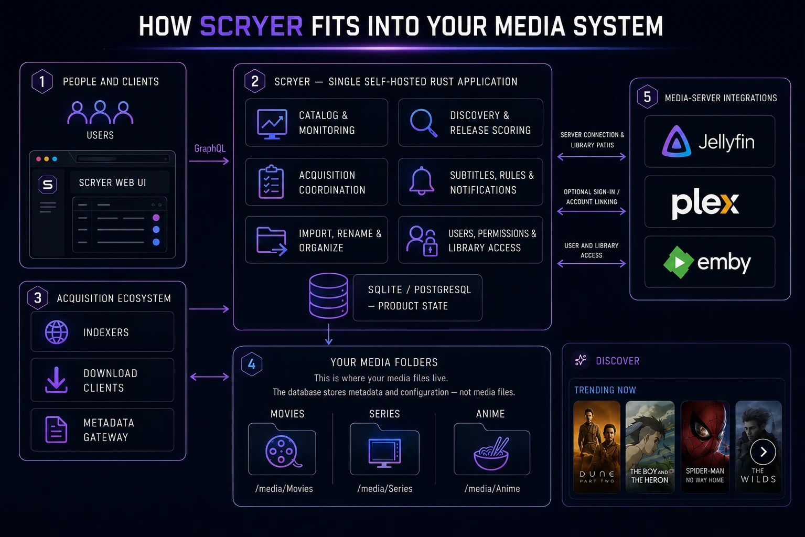

  
  
  

  
  
  

<!-- A/B alternative: separate logo and wordmark.

  
   
  

-->

  
  

  
  

<h3 align="center">
    <a href="https://www.scryer.media/scryer/docs/getting-started/"><h3>Getting Started Guide<h3></a>
</h3>

For more information about the tool, please visit the <a href="https://www.scryer.media/scryer">official webiste</a>

## What Scryer Is

Scryer is a self-hosted media management application for movies, TV series, and anime.

At a high level, it:

- monitors libraries and tracked titles
- searches for releases through indexers
- evaluates releases against quality and rules policies
- coordinates downloads and imports
- organizes your files for media servers
- manages subtitles (finds missing ones, time aligns when needed)
- deeply multi-lingual, interface and metadata (where available)
- helps you discover new media based on trends and what you already have
All packaged inside one binary.

Conceptually it is "Sonarr + Radarr + Seerr + Bazarr, with some extra bits from other *arr tools", however Scryer is a single machine-code compiled binary that runs very efficiently compared to the *arr tools.

Scryer also handles Anime much better than the Arr tools, it uses multiple anime datasources (anidb, anilist, MAL, etc), understands the nuances of anime season and episode numbering, handles episode and multiseason packs cleanly, and even knows which episodes and movies are filler or canon!

*Scryer was written from scratch and has no affiliation with the Servarr tools*

## Technical Overview

Scryer ships as a single Rust binary with:

- an embedded web UI
- a GraphQL API
- SQLite-backed application state
- a plugin runtime for indexers, download clients, subtitle providers, and notifications

## Architecture

## Docker

Scryer publishes a first-party container image:

- `ghcr.io/scryer-media/scryer:latest`
- `ghcr.io/scryer-media/scryer:<minor>-latest`
   - `15-latest` for the `0.15.x` line

For Docker installation, Compose examples, environment variables, volumes, and
deployment notes, see the [Docker install
docs](https://www.scryer.media/scryer/docs/getting-started/#docker-compose).

## Windows

Scryer publishes two forms of installation for Windows:

- scryer-windows-x86_64.zip, in which contains: scryer.exe | best ran as an [nssm (the Non-Sucking Service Manager)](https://nssm.cc/download) service (Not Recommended)
- scryer.msi | Windows service install that's completely effortless. Install's the same way as the ARR* stack. (Recommended)

## Unraid

Scryer publishes a first-party unraid application, [view unraid community appication here](https://ca.unraid.net/apps/scryer-1ess99l0zy36id).

Installation Steps:
- Open your Unraid Dashboard.
- Navigate to the apps page.
- Search "Scryer" and click install!

### Support
If you're facing any issues with installation or issues, feel free to use any of our social platforms (Discord, Reddit, Github) for support!

## Development

- [Contributing guide](CONTRIBUTING.md)
- [Architecture notes](ARCHITECTURE.md)
- [Issues](https://github.com/scryer-media/scryer/issues)

For installation, upgrade guidance, and end-user documentation, use the website links at the top of this file.

  

