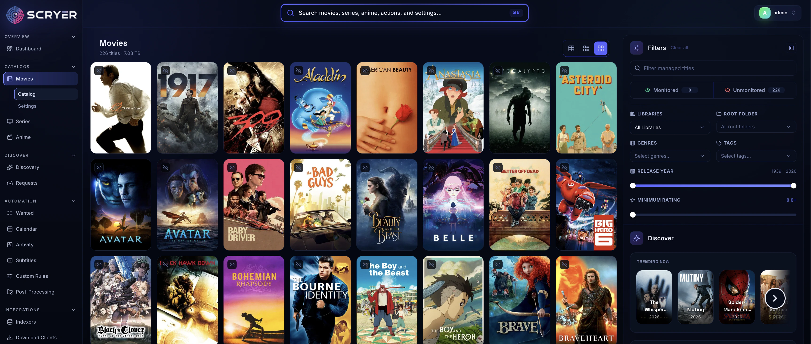

# Scryer

<p align="center">
  <a href="https://github.com/scryer-media/scryer/releases"></a>
  <a href="https://ghcr.io/scryer-media/scryer"></a>
  <a href="https://securityscorecards.dev/viewer/?uri=github.com/scryer-media/scryer"></a>
</p>

<p align="center">
  <a href="https://www.scryer.media/scryer/donate/"></a>
  <a href="https://www.reddit.com/r/scryer_media/"></a>
  <a href="https://discord.gg/SQmtZTanqm"></a>
</p>

[](https://www.scryer.media/scryer/)


<h3 align="center">
    <a href="https://www.scryer.media/scryer/docs/getting-started/">Getting Started Guide</a>
</h3>

<p align="center">
For more information about the tool, please visit the <a href="https://www.scryer.media/scryer">official webiste</a>
</p>

## What Scryer Is

Scryer is a self-hosted media management application for movies, TV series, and anime.

At a high level, it:

- monitors libraries and tracked titles
- searches for releases through pluggable providers
- evaluates releases against quality and rules policies
- coordinates downloads and imports
- organizes files for downstream media servers
- manages subtitles
- deeply multi-lingual, when you select your chosen language, your content gets updated as well (limited to upstream language content availability)

Conceptually it is "Sonarr + Radarr, with some extra bits from other *arr tools", however Scryer is a machine-code compiled binary that runs very efficiently compared to the *arr tools.

*Scryer was written from scratch and has no affiliation with the Servarr tools*

## Technical Overview

Scryer ships as a single Rust binary with:

- an embedded web UI
- a GraphQL API
- SQLite-backed application state
- a plugin runtime for indexers, download clients, subtitle providers, and notifications

## Architecture

```text
┌─────────────────────────────────────────┐
│  scryer binary                          │
│  ┌───────────┐  ┌────────────────────┐  │
│  │ Web UI    │  │ GraphQL API        │  │
│  └───────────┘  └────────────────────┘  │
│  ┌───────────────────────────────────┐  │
│  │ Application layer                 │  │
│  │ acquisition · import · subtitles  │  │
│  │ rename · post-processing · rules  │  │
│  └───────────────────────────────────┘  │
│  ┌───────────────────────────────────┐  │
│  │ Plugin System (WASM)              │  │
│  └───────────────────────────────────┘  │
│  ┌───────────────────────────────────┐  │
│  │ Storage (SQLite)                  │  │
│  └───────────────────────────────────┘  │
└─────────────────────────────────────────┘
         │                     │
    ┌────┴─────┐         ┌─────┴──────┐
    │ Metadata │         │ Indexers & │
    │  API     │         │ Clients    │
    └──────────┘         └────────────┘
```

## Windows desktop

Windows releases provide x64 and ARM64 MSI installers plus matching ZIPs. The MSI installs
`scryer.exe` for command-line use and `scryer-tray.exe` for the desktop experience. The tray
starts Scryer at sign-in without opening a browser, and its menu opens or manages the local UI.
Its independent desktop profile is `%LOCALAPPDATA%\ScryerMedia\Scryer`; it does not migrate or
modify legacy portable data.

The first Windows release line is intentionally unsigned. Windows may show a browser download
warning, SmartScreen’s **More info → Run anyway** prompt, and an **Unknown publisher** UAC prompt
for the machine-wide MSI. Verify the release SHA-256 checksum and GitHub build provenance before
installing. WinGet uses the same MSI once its `ScryerMedia.Scryer` manifest has been accepted.

## Docker

Scryer publishes a first-party container image:

- `ghcr.io/scryer-media/scryer:latest` runs one portable Linux payload through the launcher while retaining runtime CPU dispatch inside dependencies and Wasm plugins
- `ghcr.io/scryer-media/scryer:<minor>-latest` tracks a stable release line without moving to the next breaking branch, for example `15-latest` for the `0.15.x` line
- `ghcr.io/scryer-media/scryer:pr-<number>-rc` and `ghcr.io/scryer-media/scryer:pr-<number>-<shortsha>` are PR candidate images; they never move `latest`

For Docker installation, Compose examples, environment variables, volumes, and
deployment notes, see the [Docker install
docs](https://www.scryer.media/scryer/docs/getting-started/#docker-compose).

## Development

- [Contributors guide](CONTRIBUTORS.md)
- [Architecture notes](ARCHITECTURE.md)
- [Issues](https://github.com/scryer-media/scryer/issues)

For installation, upgrade guidance, and end-user documentation, use the website links at the top of this file.

---
*All media images courtesy of [thetvdb](https://thetvdb.com/)*
